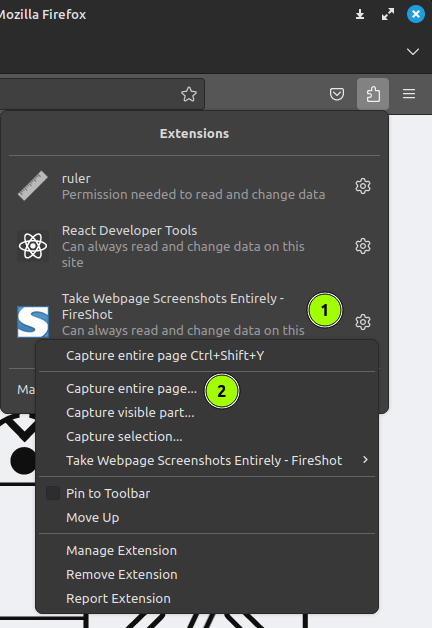
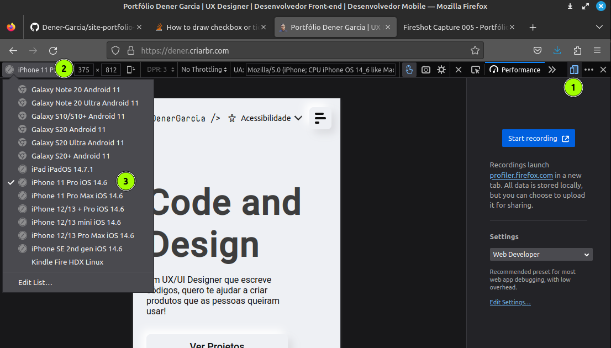

# 📸 Capturando imagens com Fireshot

Após instalar o fireshot no seu navegador baseado em chrome ou mozilla, faça um screenshot das páginas que você deseja destacar no Github.

## 🖥️ Screenshot desktop

Abra sua aplicação no browser procure pelo fireshot na barra superior, em alguns navegadores ele pode estar dentro de um sub-menu.

Clic na engrenagem e procure por Capture entiere page

A mágina já vai acontecer, salve a imagem ou pdf e pronto.

## 📱 Screenshot Mobile

Aperte teclad F12 para mostrar as ferramentas de desenvolvimento do navegador.

Procure pelo icone de responsive design mode ou aperte as teclas de atalho ctrl + shift + m.

Selecione um modelo de smartphone e faca os passos abaixo:

Abra sua aplicação no browser procure pelo fireshot na barra superior, em alguns navegadores ele pode estar dentro de um sub-menu.

Clic na engrenagem e procure por Capture entiere page

A mágina já vai acontecer, salve a imagem ou pdf e pronto.

