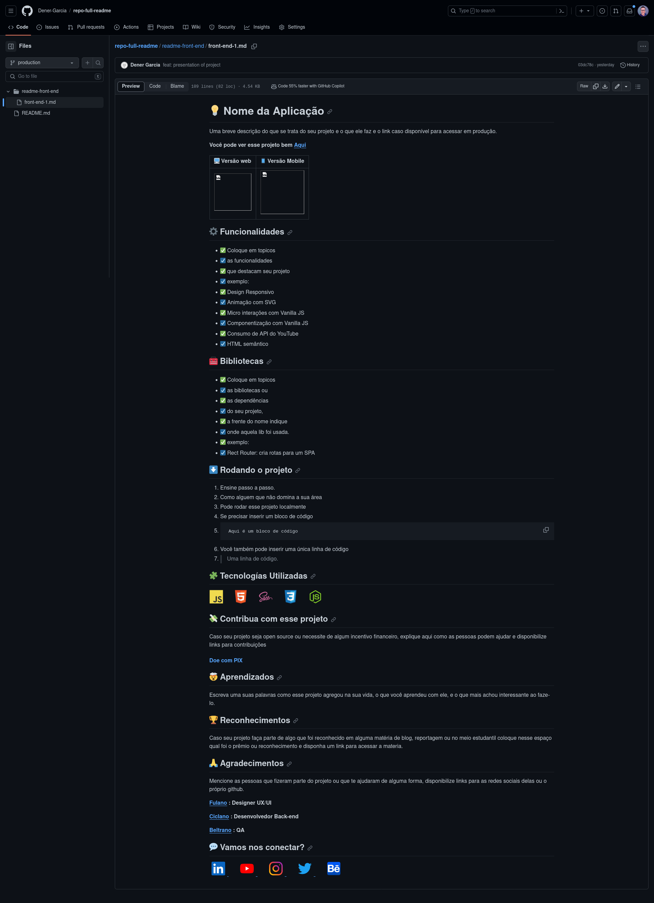

# 💡 Nome da Aplicação

Uma breve descrição do que se trata do seu projeto e o que ele faz e o link caso disponível para acessar em produção.

__Você pode ver esse projeto bem  [Aqui](https://www.seuSite.com.br)__


🖥️ Pagina 1 Home                                        | 🖥️ Versão 2 Sobre                                        | 🖥️ Pagina 3 Serviços   
:----------:                                            | :--------------:                                        | :--------------: 
   |    |  

## ⚙️ Funcionalidades

- ✅ Coloque em topicos
- ☑️ as funcionalidades
- ✅ que destacam seu projeto
- ☑️ exemplo:
- ✅ Design Responsivo
- ☑️ Animação com SVG
- ✅ Micro interações com Vanilla JS
- ☑️ Componentização com Vanilla JS
- ✅ Consumo de API do YouTube
- ☑️ HTML semântico

## 🧰 Bibliotecas

- ✅ Coloque em topicos
- ☑️ as bibliotecas ou
- ✅ as dependências
- ☑️ do seu projeto,
- ✅ a frente do nome indique
- ☑️ onde aquela lib foi usada.
- ✅ exemplo:
- ☑️ Rect Router: cria rotas para um SPA

## ⬇️ Rodando o projeto

1. Ensine passo a passo.
2. Como alguem que não domina a sua área
3. Pode rodar esse projeto localmente
4. Se precisar inserir um bloco de código
5. ```
    Aqui é um bloco de código
    ```
6. Você também pode inserir uma única linha de código
7. > Uma linha de código.

## 🧩 Tecnologías Utilizadas

<div align="left">
  
  
  
  
  
  
  
  
  
</div>

## ⌛ Status do projeto

- [ ] Coloque em tópicos e marque
- [x] As principais features
- [x] Que já estão prontas. 
- [ ] Deixe em branco o que esta faltando

## 💸 Contribua com esse projeto

Caso seu projeto seja open source ou necessite de algum incentivo financeiro, explique aqui como as pessoas podem ajudar e disponibilize links para contribuições

#### [Doe com PIX](https:linkPix.com.br)

## 🤯 Aprendizados

Escreva uma suas palavras como esse projeto agregou na sua vida, o que você aprendeu com ele, e o que mais achou interessante ao faze-lo.

## 🏆 Reconhecimentos

Caso seu projeto faça parte de algo que foi reconhecido em alguma matéria de blog, reportagem ou no meio estudantil coloque nesse espaço qual foi o prêmio ou reconhecimento e disponha um link para acessar a materia.

## 🙏 Agradecimentos

Mencione as pessoas que fizeram parte do projeto ou que te ajudaram de alguma forma, disponibilize links para as redes sociais delas ou o próprio github.

__[Fulano](https://www.linkedin/in/fulano) : Designer UX/UI__

__[Ciclano](https://www.linkedin/in/fulano) : Desenvolvedor Back-end__

__[Beltrano](https://www.linkedin/in/fulano) : QA__


## 💬 Vamos nos conectar?

<div align="left">
  <a href="https://" target="_blank">
    
  </a>
    
  <a href="https://" target="_blank">
    
  </a>
    
  <a href="https://" target="_blank">
  
  </a>
    
  <a href="https://" target="_blank">
    
  </a>
    
  <a href="https://" target="_blank">
    
  </a>
</div>
